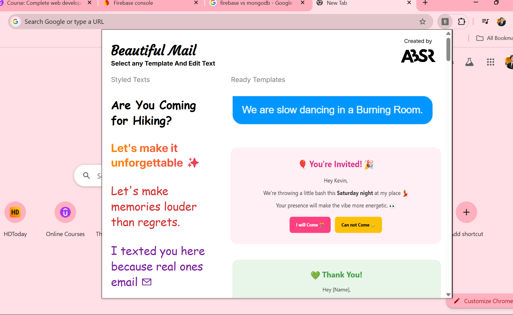

## ✨ BEAUTIFUL MAIL

### Why only companies can send beautiful colored emails with buttons and logos, I built this chrome extension so that anyone can send these beautiful mails anytime.

Just select the template and it will open your gmail website with template already in the compose box
Change the text with your message, press send and make the receiver astonished.



### Unfortunately I am not able to publish this chrome extension in the chrome web store.

## Clone and use directly

## 🚀 Installation Guide

Follow these steps to install the Beautiful Mail Chrome Extension from source:

### 1. Clone the Repository

```bash
git clone https://github.com/abhisarxverma/Beautful_mail.git
```

### 2. Open Chrome Extensions Page

**Open Google Chrome.**

**Go to: chrome://extensions/**

**Enable Developer Mode (toggle in the top-right corner).**

### 3. Load the Extension

**Click "Load unpacked".**

**Select the folder where you cloned the repository (beautiful-mail).**

### 4. Use the Extension

**Click the Beautiful Mail icon in your Chrome toolbar.**

**Choose a template from the popup.**

**Gmail will open with the selected template preloaded in the compose box.**

**Personalize your message and hit Send!**

### 🛠️ Troubleshooting
**Make sure you're logged into Gmail before selecting a template.**

**If the extension icon is hidden, click the puzzle piece 🔧 in the toolbar and pin Beautiful Mail.**

### 💡 Contribute or Customize

**Want to add your own templates or improve the extension? Feel free to fork the repo and submit a pull request!**
